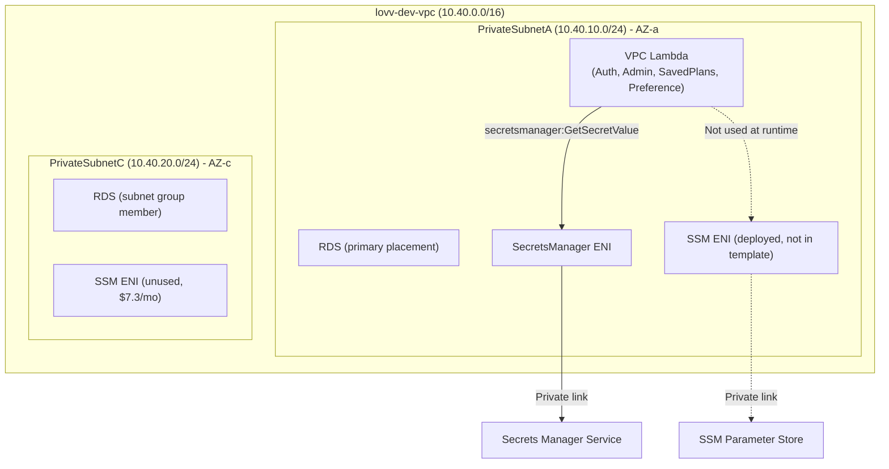
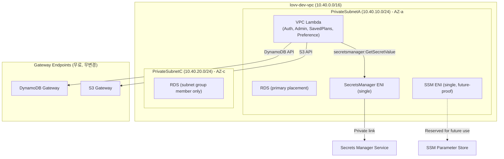

# Design Document: VPC Cost Optimization

## Overview

`lovv-dev-data-stack` CloudFormation 스택의 VPC Interface Endpoint 비용을 최적화한다. SSM과 Secrets Manager Interface VPC Endpoint를 각각 단일 AZ(PrivateSubnetA, 1 ENI)로 축소하여 월 약 $14.6를 절감하며, Lambda 기능과 RDS 보안 격리를 유지한다.

현재 상태:
- `SecretsManagerVpcEndpoint`: 템플릿에 정의됨, SubnetIds에 PrivateSubnetA 1개만 포함 (이미 단일 AZ)
- `SSMVpcEndpoint`: 실제 AWS 환경에 배포되어 있으나 (`vpce-0acf51d81b0dfe1ec`), CloudFormation 템플릿에 리소스 정의가 누락된 상태
- NAT 인스턴스: `EnableNatInstance=false`가 기본값이며 유휴 상태에서 비용 발생 가능

설계 목표:
1. `SSMVpcEndpoint` 리소스를 CloudFormation 템플릿에 단일 AZ로 정의하여 IaC 관리 하에 둔다
2. `SecretsManagerVpcEndpoint`가 단일 AZ(PrivateSubnetA)를 유지함을 명시적으로 확인한다
3. Gateway Endpoint(S3, DynamoDB)는 변경하지 않는다
4. RDS 보안 격리를 유지한다
5. NAT 인스턴스 운영 가이드를 README에 추가한다

## Architecture

### 현재 아키텍처 (변경 전)



### 목표 아키텍처 (변경 후)



### 변경 요약

| 리소스 | 변경 전 | 변경 후 | 비용 영향 |
|--------|---------|---------|-----------|
| `SSMVpcEndpoint` | 2 AZ (템플릿 외 관리) | 1 AZ (PrivateSubnetA, 템플릿 관리) | -$7.3/월 |
| `SecretsManagerVpcEndpoint` | 1 AZ (PrivateSubnetA) | 1 AZ (무변경 확인) | $0 |
| `DynamoDBGatewayEndpoint` | Gateway (무료) | 무변경 | $0 |
| `S3GatewayEndpoint` | Gateway (무료) | 무변경 | $0 |
| NAT Instance | running (유휴) | 운영 가이드 추가 | -$3/월 (수동 중지 시) |

> 참고: 기존 보고서에서는 SSM과 SecretsManager 모두 2 AZ라고 기술했으나, 현재 템플릿의 `SecretsManagerVpcEndpoint`는 이미 `LovvPrivateSubnetA` 1개만 포함하고 있다. SSM 엔드포인트를 템플릿에 단일 AZ로 추가하여 IaC 정합성을 확보하고, 2번째 AZ ENI를 제거함으로써 ~$7.3/월을 절감한다.

## Components and Interfaces

### 1. CloudFormation 템플릿 변경 (`infra/data-stack/template.yaml`)

#### 1.1 SSMVpcEndpoint 리소스 추가

```yaml
# SSM Parameter Store VPC Endpoint: 현재 Lambda 런타임에서 미사용이나 향후 활용 가능성을 고려하여 단일 AZ로 유지한다.
SSMVpcEndpoint:
  Type: AWS::EC2::VPCEndpoint
  Properties:
    VpcId: !Ref LovvDevVPC
    ServiceName: !Sub com.amazonaws.${AWS::Region}.ssm
    VpcEndpointType: Interface
    PrivateDnsEnabled: true
    SubnetIds:
      - !Ref LovvPrivateSubnetA
    SecurityGroupIds:
      - !Ref LovvEndpointSecurityGroup
```

배치 위치: `SecretsManagerVpcEndpoint` 바로 뒤, `DynamoDBGatewayEndpoint` 앞에 배치한다.

#### 1.2 SecretsManagerVpcEndpoint 확인 (무변경)

현재 템플릿의 `SecretsManagerVpcEndpoint`는 이미 단일 AZ(`LovvPrivateSubnetA`)로 구성되어 있으므로 변경하지 않는다.

```yaml
# 현재 상태 (변경 없음)
SecretsManagerVpcEndpoint:
  Type: AWS::EC2::VPCEndpoint
  Properties:
    VpcId: !Ref LovvDevVPC
    ServiceName: !Sub com.amazonaws.${AWS::Region}.secretsmanager
    VpcEndpointType: Interface
    PrivateDnsEnabled: true
    SubnetIds:
      - !Ref LovvPrivateSubnetA
    SecurityGroupIds:
      - !Ref LovvEndpointSecurityGroup
```

#### 1.3 Gateway Endpoint (무변경)

`DynamoDBGatewayEndpoint`와 `S3GatewayEndpoint`는 변경하지 않는다.

### 2. README 업데이트 (`infra/data-stack/README.md`)

NAT 인스턴스 운영 가이드 섹션을 추가한다:

- NAT 인스턴스를 DB 작업 시에만 활성화/비활성화하는 절차
- AWS CLI를 이용한 수동 중지/시작 명령어
- Lambda가 NAT 인스턴스에 의존하지 않음을 명시

### 3. 테스트 코드 (`tests/test_data_stack_vpc_endpoints.py`)

새로운 테스트 파일을 작성하여 VPC Endpoint 단일 AZ 구성을 검증한다:

- `SSMVpcEndpoint` SubnetIds에 PrivateSubnetA만 포함 검증
- `SecretsManagerVpcEndpoint` SubnetIds에 PrivateSubnetA만 포함 검증
- Gateway Endpoint 무변경 검증
- RDS 보안 격리 유지 검증

### 4. 기존 테스트 업데이트 (`tests/test_data_stack_nat_instance.py`)

`test_existing_private_endpoint_and_rds_controls_remain` 테스트는 이미 `SSMVpcEndpoint:` 존재를 검증하므로, SSM 엔드포인트가 템플릿에 추가되면 자동으로 통과한다.

## Data Models

이 기능은 데이터 모델 변경을 포함하지 않는다. 모든 변경은 CloudFormation 인프라 리소스 정의에 한정된다.

### 영향받는 리소스 속성

| 리소스 | 속성 | 값 |
|--------|------|-----|
| `SSMVpcEndpoint` (신규) | `SubnetIds` | `[!Ref LovvPrivateSubnetA]` |
| `SSMVpcEndpoint` (신규) | `PrivateDnsEnabled` | `true` |
| `SSMVpcEndpoint` (신규) | `SecurityGroupIds` | `[!Ref LovvEndpointSecurityGroup]` |
| `SecretsManagerVpcEndpoint` | `SubnetIds` | `[!Ref LovvPrivateSubnetA]` (무변경) |
| `LovvDBSubnetGroup` | `SubnetIds` | `[SubnetA, SubnetC]` (무변경) |
| `LovvRDSInstance` | `PubliclyAccessible` | `false` (무변경) |

## Error Handling

### 배포 실패 시나리오

| 시나리오 | 영향 | 대응 |
|----------|------|------|
| SSMVpcEndpoint 생성 실패 | 스택 업데이트 롤백 | CloudFormation 자동 롤백으로 이전 상태 복원 |
| 기존 SSM Endpoint와 충돌 (이미 존재) | `CREATE_FAILED` | 기존 콘솔에서 생성된 엔드포인트를 삭제 후 재배포, 또는 `import` 사용 |
| Secrets Manager Endpoint ENI 삭제 실패 | 엔드포인트 업데이트 실패 | CloudFormation 자동 롤백 |

### 런타임 에러 처리

| 시나리오 | 현재 동작 | 변경 후 동작 |
|----------|-----------|-------------|
| SecretsManager Endpoint 불가 | Lambda 타임아웃 → HTTP 500 | 동일 (변경 없음) |
| SSM Endpoint 불가 | Lambda에 영향 없음 (미사용) | 동일 (미사용) |
| DynamoDB Gateway 불가 | Lambda DynamoDB 호출 실패 | 동일 (무변경) |

### CloudFormation Import 전략

기존에 콘솔/CLI로 생성된 `SSMVpcEndpoint`가 존재할 경우:

1. `aws cloudformation create-change-set --change-set-type IMPORT`를 사용하여 기존 리소스를 스택으로 가져온다
2. Import 후 SubnetIds를 `[LovvPrivateSubnetA]`로 업데이트한다
3. Import가 불가능할 경우, 기존 엔드포인트를 수동 삭제 후 스택 업데이트로 재생성한다

## Testing Strategy

### 테스트 접근 방식

이 기능은 Infrastructure as Code(CloudFormation) 변경이므로, property-based testing은 적용하지 않는다. IaC는 선언적 설정이며 입력/출력이 있는 함수가 아니므로, 스냅샷/단언 기반 테스트와 배포 후 검증이 적합하다.

### 단위 테스트 (CloudFormation 템플릿 검증)

Python `unittest`를 사용하여 YAML 템플릿 내용을 문자열/파싱 기반으로 검증한다. 기존 `test_data_stack_nat_instance.py` 패턴을 따른다.

**테스트 파일: `tests/test_data_stack_vpc_endpoints.py`**

| 테스트 케이스 | 검증 내용 |
|--------------|-----------|
| `test_ssm_endpoint_single_az` | SSMVpcEndpoint SubnetIds에 LovvPrivateSubnetA만 포함 |
| `test_ssm_endpoint_private_dns_enabled` | SSMVpcEndpoint PrivateDnsEnabled: true |
| `test_ssm_endpoint_security_group` | SSMVpcEndpoint SecurityGroupIds에 LovvEndpointSecurityGroup 포함 |
| `test_secretsmanager_endpoint_single_az` | SecretsManagerVpcEndpoint SubnetIds에 LovvPrivateSubnetA만 포함 |
| `test_gateway_endpoints_unchanged` | DynamoDB/S3 Gateway Endpoint 속성 무변경 |
| `test_rds_security_isolation` | RDS PubliclyAccessible=false, DBSubnetGroup에 양쪽 서브넷 포함 |
| `test_rds_security_group_rules` | RDS SG 인바운드 규칙이 변경 전과 동일 |
| `test_private_route_no_igw` | Private route table에 IGW 직접 라우트 없음 |
| `test_lambda_subnet_alignment` | Lambda VpcConfig SubnetIds에 PrivateSubnetA 포함 검증 (SAM 템플릿 레벨) |

### 배포 후 수동 검증 체크리스트

1. `aws cloudformation describe-stacks --stack-name lovv-dev-data-stack` → `UPDATE_COMPLETE`
2. `aws ec2 describe-vpc-endpoints` → SSM/SecretsManager 엔드포인트 SubnetIds 확인
3. Lambda 호출 → SecretsManager GetSecretValue 성공 확인
4. `aws cloudformation create-change-set` → Gateway Endpoint에 변경 action 없음 확인
5. CloudFormation changeset에서 DynamoDB/S3 Gateway Endpoint가 `Modify/Remove/Replace`에 포함되지 않음 확인

### 테스트 실행 방법

```bash
python -m pytest tests/test_data_stack_vpc_endpoints.py -v
python -m pytest tests/test_data_stack_nat_instance.py -v
```

### PBT 미적용 사유

Property-based testing은 다음 이유로 이 기능에 적합하지 않다:

- 변경 대상이 CloudFormation IaC 선언적 설정이다 (입력/출력 함수가 아님)
- 테스트 대상은 YAML 파일의 정적 구조이다
- 입력 공간이 고정되어 있으며 무작위 입력으로 검증할 로직이 없다
- 스냅샷/단언 기반 테스트와 배포 검증이 IaC에 더 적합하다
