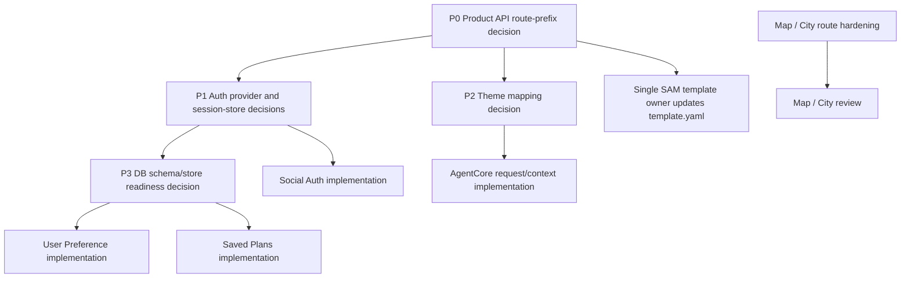

# Product API Domain Tasks

## Source Of Truth

- User Request Original:
  - Auth: Google/Kakao 로그인, 사용자 조회/생성, 세션 확인, 로그아웃.
  - User Preference: 온보딩 취향 저장, 마이페이지 취향 수정, 로그인 후 취향 로드.
  - Map / City: 소도시 마커 목록, 국가/테마/검색 필터, 소도시 상세 정보, 이미지 URL 제공.
  - AgentCore: 사용자 조건 입력, 도시/취향 컨텍스트 전달, AI 일정 생성 응답.
  - Saved Plans: 생성 일정 저장, 저장 일정 목록 조회, 좋아요/좋아요 취소, 일정 상세 조회.
- Structured Agent Contract: Integrate the five domain Specs into an implementation-ready backend task/subtask plan with ordered dependencies and parallel-safe ownership boundaries. Call out blockers where implementation must not start yet.
- Project context: `/Users/jeonjonghyeok/Documents/Final/docs/projects/lovv-project-context.md`
- Task format: `/Users/jeonjonghyeok/Documents/Final/docs/agents/spec-task-format.md`
- Context-loading rules: `/Users/jeonjonghyeok/Documents/Final/docs/agents/context-loading.md`
- Parallel Mode rules: `/Users/jeonjonghyeok/Documents/Final/docs/agents/modes/parallel.md`
- Auth Spec: `docs/specs/AUTH_SOCIAL_LOGIN_API_SPEC.md`
- User Preference Spec: `docs/specs/USER_PREFERENCE_API_SPEC.md`
- Map / City Spec: `docs/specs/MAP_CITY_API_SPEC.md`
- AgentCore Spec: `docs/specs/AGENTCORE_ITINERARY_API_SPEC.md`
- Saved Plans Spec: `docs/specs/SAVED_PLANS_API_SPEC.md`
- Database design context: `/Users/jeonjonghyeok/Documents/Final/oh_my_documents/docs/04_database_design/04_database_design.md`
- MVP API contract context: `/Users/jeonjonghyeok/Documents/Final/oh_my_documents/docs/07_api_spec/mvp_confirmed_api_contract.md`
- Current SAM template: `template.yaml`

## Integration Decisions

1. Route prefix mismatch is not fully implementation-ready.
   - Current `Lovv_BE` implementation exposes `/api/auth/login`, `/api/auth/me`, `/api/auth/logout`, `/api/small-cities`, and `/api/small-cities/{cityId}`.
   - Product/MVP planning uses `/api/v1` as the public base with logical resources such as `/auth/*`, `/me/*`, `/recommendations`, and `/destinations/*`.
   - Auth Spec prefers logical `/auth/*` paths, externally `/api/v1/auth/*` if the API Gateway base is `/api/v1`.
   - Map / City Spec explicitly preserves active backend routes `/api/small-cities` and `/api/small-cities/{cityId}` and does not replace them with `/destinations/*` without a later migration Spec.
   - Decision: preserve `/api/small-cities` for Map / City implementation work now. Block Auth, User Preference, AgentCore, and Saved Plans route coding until a Product API route-prefix decision chooses the public base and maps logical paths to SAM paths.
2. Auth context claim naming is resolved for planning but must be enforced in implementation.
   - Service JWT claim: `sub` is the authenticated Lovv service user id.
   - Internal persistence column: `user_id`.
   - Public API response field: `userId`.
   - Business handlers must derive ownership from trusted authorizer/session context only. Request bodies must not accept writable `userId`, `user_id`, owner id, or provider subject.
3. Session store and DB readiness block most product API coding.
   - Database design defines `users`, `social_accounts`, `itineraries`, `itinerary_items`, and `plan_reactions` as MySQL-ledger candidates.
   - Auth Spec adds logical `auth_sessions`, but the physical store is not approved.
   - User Preference Spec adds logical `user_preferences`, but the physical table/store is not approved.
   - Saved Plans needs final mapping for `sourceRecommendationId`, destination, themes, day grouping, full item body, snapshot hash, idempotency key, and active like uniqueness.
   - Decision: do not create DB migrations, schema files, repository code, or live DB connection code until DB direction, migration path, and connection path are explicitly approved.
4. Theme label/key mismatch blocks AgentCore retrieval and canonical theme APIs.
   - Map / City currently filters by Korean labels: `온천`, `바다`, `미식`, `전통`, `자연`, `예술`, `축제`, `산책`.
   - User Preference, AgentCore, Saved Plans, and MVP contract use canonical `themeId` values such as `history_tradition`, `food_local`, `art_sense`, and `healing_rest`.
   - Decision: Map / City keeps its current `themes` label query contract. AgentCore, preferences, and saved plans must not call `/api/small-cities` with canonical ids until a theme-id-to-label mapping contract is approved.
5. Current simple-login scaffold must be migrated or removed before production auth implementation.
   - Current scaffold is demo/local: `/api/auth/login`, `DEMO_LOGIN_*`, HMAC service token helper, stateless logout.
   - Production social auth must use Google/Kakao provider validation, service user upsert/linking, server-side sessions, and `/auth/google`, `/auth/kakao`, `/auth/session`, `/auth/me`, `/auth/logout` under the approved API base.
   - Decision: production social auth implementation is blocked until provider validation flow, session store, route prefix, and simple-login disposition are approved.

## Dependency Graph

## Phase Order

1. Phase 0: Decision gates before coding.
   - Resolve product route prefix and Lambda ownership.
   - Verify official Google/Kakao provider validation documentation.
   - Approve auth session store and DB direction.
   - Approve canonical theme-id to Map / City Korean-label mapping.
   - Decide simple-login scaffold removal or dev-only containment.
2. Phase 1: Parallel-safe ready work.
   - Map / City compatibility, filter tests, mapper/image hardening, and review can proceed because it preserves the active `/api/small-cities` contract and does not require auth/session/DB decisions.
3. Phase 2: Security-sensitive sequential work.
   - Auth social login, authorizer, sessions, cookies, CORS credentials, and `template.yaml` route migration must run through sequential implementation and security review.
4. Phase 3: User-owned persistence work.
   - User Preference and Saved Plans implementation may start only after DB schema/store readiness is approved.
5. Phase 4: AgentCore integration.
   - AgentCore may start only after route prefix, theme mapping, auth user-id normalization, and preference-read boundary are approved.
6. Phase 5: Final integrated backend review.
   - Main Codex reconciles outputs, confirms non-overlapping write scopes, runs verification, and requests Backend AWS SAM Review Agent plus Security Review Agent approval.

## Parallel Mode Scope Ownership

Unassigned files are read-only. Main Codex must update this table before allowing any new write scope. `template.yaml` has exactly one writer. DB migrations/schema files have exactly one writer and must not be created until DB direction is approved.

| Agent | Role | Task/Subtask | Write Scope | Read Scope | Forbidden Scope | Verification | Output |
| --- | --- | --- | --- | --- | --- | --- | --- |
| Product API Decision Agent | Task Agent | P0.1-P0.5 decision gates | No code writes. If user approves a follow-up decision doc, only `docs/specs/PRODUCT_API_DOMAIN_TASKS.md` or the named follow-up spec | Required source-of-truth files in this plan | `src/**`, `events/**`, `template.yaml`, tests, migrations | Static contract checks listed per subtask | Decision report with blockers cleared or still blocked |
| Map / City Implementation Agent | Implementation Agent | M1-M3 ready Map / City subtasks | `src/small_cities/**`, `tests/test_small_city_handler.py`, `tests/test_small_city_mapper.py`, `events/list-small-cities.json`, `events/detail-small-city.json` | Map / City Spec, existing small-city contracts, `template.yaml` read-only | `src/auth/**`, `src/shared/auth.py`, `template.yaml` unless Main Codex reassigns template ownership, DB migrations | `python3 -m unittest tests/test_small_city_handler.py tests/test_small_city_mapper.py` | Changed files and compatibility report |
| SAM Template Owner | Implementation Agent | Future API Gateway/SAM integration after decisions | `template.yaml` only, plus explicitly assigned route event samples | Approved route prefix decision, handler names, SAM docs when needed | Python business logic, DB migrations, frontend files | `sam validate` when available; static route/IAM/CORS review | Template route/env/IAM report |
| Auth Domain Owner | Implementation Agent | Future social auth after P0.1-P0.5 | `src/auth/**`, `src/shared/auth.py`, `tests/test_auth_app.py`, `tests/test_auth_authorizer.py`, `events/auth-*.json` | Auth Spec, provider-doc decision, DB/session decision, route decision | `src/small_cities/**`, `src/preferences/**`, saved-plan code, `template.yaml` unless assigned | Auth and authorizer unit tests | Auth implementation report |
| Preference Domain Owner | Implementation Agent | Future preference APIs after DB/auth decisions | `src/preferences/**`, `tests/test_preferences*.py`, approved preference event samples | User Preference Spec, auth user-id contract, DB decision | `src/auth/**` except approved interface imports, `template.yaml`, DB migrations | Focused preference validation/auth-isolation tests | Preference implementation report |
| AgentCore Domain Owner | Implementation Agent | Future recommendation API after theme/auth/preference decisions | `src/agentcore/**`, `tests/test_agentcore*.py`, approved recommendation event samples | AgentCore Spec, theme mapping, preference read boundary, Map / City contract | `src/auth/**`, `src/small_cities/**`, `src/saved_plans/**`, DB migrations, `template.yaml` unless assigned | Mocked AgentCore adapter and response-mapping tests | AgentCore implementation report |
| Saved Plans Domain Owner | Implementation Agent | Future saved-plan APIs after DB/auth/AgentCore decisions | `src/saved_plans/**`, `tests/test_saved_plans*.py`, approved saved-plan event samples | Saved Plans Spec, AgentCore save-compatible response, DB decision | `src/auth/**`, `src/agentcore/**`, `template.yaml` unless assigned | Save/list/detail/reaction/idempotency tests | Saved Plans implementation report |
| DB Schema Owner | Database Planning/Implementation Agent | Future schema/migration after DB approval | Approved migrations/schema directory only after Main Codex names it | DB design, Auth/User Preference/Saved Plans Specs | Any app code, `template.yaml`, frontend files | Migration dry-run/rollback command defined by approved DB tool | DB readiness and migration report |
| Backend Product API Review Agent | Review Agent | Final integrated review | Read-only | Changed-file list, source-of-truth files, verification outputs | Any file writes | Review checklist, security findings, test evidence | Approval or blocker findings |

## Blocked Decision Subtasks

### Subtask P0.1: Product API Route Prefix And Lambda Ownership Decision

- Purpose: `/auth/*`, `/me/*`, `/api/v1/*`, and existing `/api/small-cities` route boundaries must be reconciled before any product-route implementation begins.
- Required Context:
  - Project context Backend API Routing and Existing API Source Of Truth sections.
  - Auth, User Preference, Map / City, AgentCore, Saved Plans Specs.
  - MVP API contract section 2-4.
  - `template.yaml`.
- Context Budget:
  - Must read: source files listed above.
  - Do not read: frontend files, `.aws-sam/**`, `.git/**`, generated build output.
  - Optional read: SAM docs for HTTP API base path/stage behavior if the route decision depends on API Gateway syntax.
- Source Of Truth:
  - Logical product APIs are defined by the five domain Specs and MVP API contract.
  - Current backend compatibility route for Map / City is `GET /api/small-cities`.
- Target Files:
  - No source-code writes. Decision output only.
- Out Of Scope:
  - No route implementation.
  - No `template.yaml` edits.
  - No frontend adapter changes.
- Acceptance Criteria:
  - One public API base decision is recorded for Auth, User Preference, AgentCore, and Saved Plans.
  - Existing `/api/small-cities` compatibility status is explicit.
  - `/destinations/*` is either deferred or mapped by a separate migration Spec.
  - Exactly one future owner is assigned for `template.yaml`.
- Verification Commands:
  - `rg -n "/api/v1|/api/auth|/auth/|/me/|/api/small-cities|/destinations|/recommendations" docs/specs template.yaml src events tests`
  - `git diff --name-only`
- Required Review Agents:
  - Backend AWS SAM Review Agent.
  - API Contract Review Agent.

### Subtask P0.2: Auth Provider Validation And Simple-Login Disposition Decision

- Purpose: Google/Kakao validation flow and current demo login removal/dev-only containment must be decided before Auth implementation.
- Required Context:
  - `docs/specs/AUTH_SOCIAL_LOGIN_API_SPEC.md`
  - Current `template.yaml`
  - Current `src/auth/**`, `src/shared/auth.py`, `events/auth-*.json`, and auth tests for scaffold inventory.
  - Current official Google and Kakao auth documentation checked at implementation time.
- Context Budget:
  - Must read: Auth Spec provider validation, session/JWT, simple-login scaffold disposition, security sections.
  - Do not read: Map / City implementation unless route integration requires read-only template context.
  - Optional read: official provider docs.
- Source Of Truth:
  - Auth Spec supersedes the MVP simple-login scaffold for production social login.
- Target Files:
  - No source-code writes. Decision output only.
- Out Of Scope:
  - No provider code.
  - No real secrets.
  - No provider console configuration.
- Acceptance Criteria:
  - Google and Kakao accepted credential types and server-side validation paths are named.
  - Required dummy env var names are listed without real values.
  - `POST /api/auth/login` is marked for removal or local/dev-only containment.
  - Production auth cannot expose a demo-login bypass.
- Verification Commands:
  - `rg -n "DEMO_LOGIN|/api/auth/login|/auth/google|/auth/kakao|credentialType|GOOGLE_|KAKAO_" template.yaml src events tests docs/specs/AUTH_SOCIAL_LOGIN_API_SPEC.md`
  - `git diff --name-only`
- Required Review Agents:
  - Backend AWS SAM Review Agent.
  - Security Review Agent.

### Subtask P0.3: Auth Context And Session Store Readiness Decision

- Purpose: user identity, session invalidation, and logout behavior require a trusted user-id contract and approved session store.
- Required Context:
  - Auth Spec Session/JWT and Data Model sections.
  - User Preference Auth Dependency section.
  - Saved Plans Auth Dependency section.
  - Database design `users`, `social_accounts`, and storage responsibility sections.
  - Current authorizer output in `src/auth/authorizer.py`.
- Context Budget:
  - Must read: listed auth and DB sections.
  - Do not read: frontend code, generated artifacts, real env files.
  - Optional read: only official JWT/cookie/security docs needed by Security Review.
- Source Of Truth:
  - JWT `sub` equals Lovv service user id.
  - DB column is `user_id`.
  - API response field is `userId`.
- Target Files:
  - No source-code writes. Decision output only.
- Out Of Scope:
  - No session repository.
  - No DB migration.
  - No authorizer rewrite.
- Acceptance Criteria:
  - The authorizer-to-handler context shape is explicit.
  - `auth_sessions` physical store, TTL, indexes, cleanup, and revocation policy are approved or still blocked.
  - Logout revocation behavior and authorizer cache policy are explicit.
- Verification Commands:
  - `rg -n "\"sub\"|userId|user_id|auth_sessions|sid|session_token_hash|revoked" docs/specs src/auth src/shared tests`
  - `git diff --name-only`
- Required Review Agents:
  - Security Review Agent.
  - Database Review Agent.

### Subtask P0.4: Product DB Store And Migration Readiness Decision

- Purpose: user preferences, sessions, saved itineraries, and plan reactions cannot be coded until physical storage and migration ownership are approved.
- Required Context:
  - Database design sections for `users`, `social_accounts`, `itineraries`, `itinerary_items`, `plan_reactions`, DynamoDB responsibilities, and API identifier mapping.
  - Auth Spec `auth_sessions` logical model.
  - User Preference Spec `user_preferences` logical model.
  - Saved Plans Spec data model mapping and known gaps.
- Context Budget:
  - Must read: listed DB and domain-model sections.
  - Do not read: unrelated frontend, `.aws-sam/**`, raw data dumps, generated logs.
  - Optional read: approved DB toolchain docs after DB engine is confirmed.
- Source Of Truth:
  - Project context says database direction is not finalized.
  - Database design references MySQL 8 LTS as a planning target, not proof of ready migrations or live connectivity.
- Target Files:
  - No source-code writes.
  - No migration/schema files until DB direction is approved.
- Out Of Scope:
  - No DDL.
  - No repositories.
  - No seed data.
  - No live DB connection code.
- Acceptance Criteria:
  - Physical store for `auth_sessions`, `user_preferences`, `itineraries`, `itinerary_items`, and `plan_reactions` is approved or explicitly blocked.
  - Migration directory/tooling/rollback command is named before DB Schema Owner starts work.
  - `plan_reactions` uniqueness for active likes is decided.
  - Saved-plan snapshot/idempotency fields are mapped.
- Verification Commands:
  - `rg -n "auth_sessions|user_preferences|itineraries|itinerary_items|plan_reactions|sourceRecommendationId|idempotency|snapshot_hash|unique" docs/specs /Users/jeonjonghyeok/Documents/Final/oh_my_documents/docs/04_database_design/04_database_design.md`
  - `find . -maxdepth 3 -type d \\( -name migrations -o -name schema -o -name db \\) -print`
  - `git diff --name-only`
- Required Review Agents:
  - Database Review Agent.
  - Security Review Agent.

### Subtask P0.5: Theme Mapping And Destination Identifier Decision

- Purpose: AgentCore, preferences, saved plans, and map filters must agree how canonical `themeId` values map to current Map / City Korean theme labels and city identifiers.
- Required Context:
  - Map / City Spec Filter Requirements and Theme Mapping Behavior.
  - User Preference Spec Preference Field Requirements and Option Source.
  - AgentCore Spec Request Field Rules, Context Contract, and Risks.
  - Saved Plans Spec request/response themes.
  - MVP API contract theme onboarding and recommendations sections.
- Context Budget:
  - Must read: listed theme and identifier sections.
  - Do not read: auth code, provider docs, DB migrations.
  - Optional read: existing mapper tests when verifying current Korean labels.
- Source Of Truth:
  - Map / City HTTP filter uses Korean labels.
  - Product preference/recommendation APIs use canonical `themeId`.
- Target Files:
  - No source-code writes. Decision output only.
- Out Of Scope:
  - No new `/themes/onboarding-options` implementation.
  - No change to `/api/small-cities` query contract.
  - No destination migration from `cityId` to product `destinationId` without a separate approved route migration.
- Acceptance Criteria:
  - Every approved canonical `themeId` maps to one or more Map / City labels or is marked unsupported for MVP.
  - `destinationId` and `cityId` aliasing rules are explicit for AgentCore and Saved Plans.
  - AgentCore retrieval cannot pass unsupported canonical ids into `/api/small-cities?themes=`.
- Verification Commands:
  - `rg -n "온천|바다|미식|전통|자연|예술|축제|산책|themeId|history_tradition|food_local|art_sense|healing_rest|destinationId|cityId" docs/specs /Users/jeonjonghyeok/Documents/Final/oh_my_documents/docs/07_api_spec/mvp_confirmed_api_contract.md src/small_cities tests`
  - `git diff --name-only`
- Required Review Agents:
  - Backend AWS SAM Review Agent.
  - Product API Contract Review Agent.

## Implementation-Ready Subtasks

### Subtask M1: Map / City Contract Compatibility Review

- Purpose: Preserve the active small-city list/detail contract while product API route decisions are pending.
- Required Context:
  - `docs/specs/MAP_CITY_API_SPEC.md`
  - Existing small-city source and tests.
  - `template.yaml` read-only route check.
- Context Budget:
  - Must read: Map / City Spec, `src/small_cities/**`, `tests/test_small_city_handler.py`, `tests/test_small_city_mapper.py`, `template.yaml`.
  - Do not read: auth implementation details, DB migration docs, frontend files, `.aws-sam/**`.
  - Optional read: existing small-city API/data contract docs if a mismatch appears.
- Source Of Truth:
  - `GET /api/small-cities`
  - `GET /api/small-cities/{cityId}`
- Target Files:
  - No writes for this review subtask.
- Out Of Scope:
  - Do not replace routes with `/destinations/*`.
  - Do not add auth to small-city routes.
  - Do not add external map/image provider calls.
- Acceptance Criteria:
  - Active routes, query params, response fields, marker projection, and image behavior are confirmed compatible with the Spec.
  - Any mismatch is reported before M2 or M3 edits begin.
- Verification Commands:
  - `python3 -m unittest tests/test_small_city_handler.py tests/test_small_city_mapper.py`
  - `rg -n "Path: /api/small-cities|Path: /api/small-cities/\\{cityId\\}|TOUR_KOREA_TABLE_NAME|dynamodb:Scan|dynamodb:Query" template.yaml`
- Required Review Agents:
  - Backend Map / City Review Agent.

### Subtask M2: Map / City Filter And Response Test Hardening

- Purpose: Ensure country, theme, search, pagination, invalid-query, and response-shape behavior is covered by tests.
- Required Context:
  - `docs/specs/MAP_CITY_API_SPEC.md`
  - Existing small-city handler/service tests and implementation files.
- Context Budget:
  - Must read: Map / City Spec API Contract and Filter Requirements, `tests/test_small_city_handler.py`, `src/small_cities/app.py`, `src/small_cities/service.py`.
  - Do not read: auth code, DB migration docs, AgentCore code, frontend files.
  - Optional read: mapper tests only when fixtures need shared city records.
- Source Of Truth:
  - Map / City Spec R6-R13 and `GET /api/small-cities` contract.
- Target Files:
  - `tests/test_small_city_handler.py`
  - `src/small_cities/app.py`
  - `src/small_cities/service.py`
- Out Of Scope:
  - No `template.yaml` edits.
  - No route rename.
  - No auth, preference, AgentCore, or saved-plan behavior.
- Acceptance Criteria:
  - Tests cover valid `country`, `q`, `themes`, `page`, `page_size`, and composed filters.
  - Tests cover invalid country, unsupported theme labels, overlong search, and response envelope shape.
  - Existing list response remains `SmallCityApiListResponse`, not a narrowed marker-only payload.
- Verification Commands:
  - `python3 -m unittest tests/test_small_city_handler.py`
  - `python3 -m unittest tests/test_small_city_handler.py tests/test_small_city_mapper.py`
- Required Review Agents:
  - Backend Map / City Review Agent.

### Subtask M3: Map / City Mapping And Image URL Hardening

- Purpose: Make city record mapping deterministic for representative coordinates, themes, highlights, and nullable `image_url`.
- Required Context:
  - `docs/specs/MAP_CITY_API_SPEC.md`
  - Existing small-city mapper/repository tests and implementation files.
- Context Budget:
  - Must read: Map / City Spec Data Source/Mapping, Representative Coordinate Behavior, Theme Mapping Behavior, Image URL Behavior, `src/small_cities/mapper.py`, `src/small_cities/dynamodb_repository.py`, `tests/test_small_city_mapper.py`.
  - Do not read: auth code, preference code, AgentCore code, frontend files.
  - Optional read: handler tests if mapper behavior affects handler fixtures.
- Source Of Truth:
  - Supported labels: `온천`, `바다`, `미식`, `전통`, `자연`, `예술`, `축제`, `산책`.
  - `image_url` is optional and nullable.
- Target Files:
  - `src/small_cities/mapper.py`
  - `src/small_cities/dynamodb_repository.py`
  - `tests/test_small_city_mapper.py`
- Out Of Scope:
  - No external provider calls.
  - No image download, proxy, transform, or re-host.
  - No canonical `themeId` support in `/api/small-cities`.
- Acceptance Criteria:
  - No-coordinate source rows degrade according to the Spec.
  - Theme aliases normalize deterministically into supported labels.
  - Missing or invalid image URLs do not fail the entire city record.
  - Mapper tests prove deterministic ordering and fallback behavior.
- Verification Commands:
  - `python3 -m unittest tests/test_small_city_mapper.py`
  - `python3 -m unittest tests/test_small_city_handler.py tests/test_small_city_mapper.py`
- Required Review Agents:
  - Backend Map / City Review Agent.

## Deferred Coding Areas

The following are intentionally not implementation-ready. After P0 decisions are approved, Task Agent must create a narrower implementation subtask sheet before any Implementation Agent edits code.

| Area | Blocker | Next Task Type |
| --- | --- | --- |
| Social Auth | Provider validation flow, route prefix, session store, simple-login disposition, CORS/cookie policy | Security-sensitive sequential implementation tasks |
| User Preferences | Auth user-id contract and `user_preferences` physical store/migration missing | DB-gated implementation tasks |
| AgentCore | Route prefix, theme-id-to-label mapping, preference-read boundary, AgentCore deployment/model configuration missing | API/context implementation tasks with mocked AgentCore adapter first |
| Saved Plans | DB schema gaps for snapshots/day grouping/idempotency/reactions and AgentCore save-compatible payload dependency | DB-gated implementation tasks |
| `template.yaml` product route expansion | Route prefix, handler names, env vars, IAM, CORS credentials not finalized | Single-owner SAM template task |
| DB migrations/schema | DB engine/tooling/readiness not approved | Single-owner DB schema task after approval only |

## Final Review Gate

- Main Codex must confirm no write scopes overlapped.
- Main Codex must confirm `template.yaml` had only one writer.
- Main Codex must confirm DB migration/schema files were not created before DB approval.
- Backend Product API Review Agent must compare completed work against User Request Original and the Structured Agent Contract.
- Security Review Agent is required before approving auth, sessions, cookies, CORS credentials, IAM, user-owned persistence, or AI context handoff.
- Database Review Agent is required before approving any schema/migration/repository work for sessions, preferences, saved plans, or reactions.
